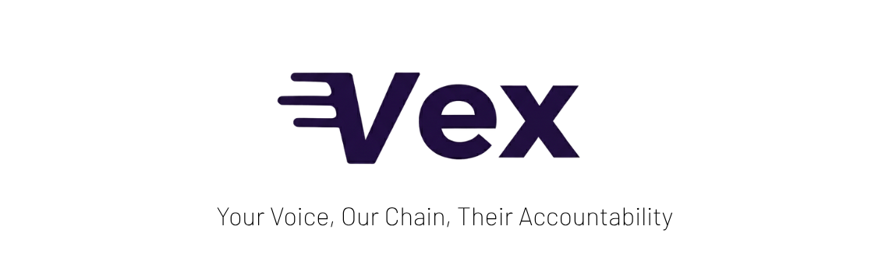

# VEX - Decentralized Business Review Platform

## Overview

VEX is a revolutionary decentralized platform that connects companies to the blockchain ecosystem, enabling transparent business registration and community evaluation through verified customer feedback. Built on the Internet Computer Protocol (ICP), VEX addresses the critical trust gap in online business reviews.

## Problem

- **61% of consumers** experience unreliable apps/websites weekly
- **44% of consumers** stop buying from companies due to lack of trust
- Traditional review platforms suffer from fake reviews and manipulation
- Businesses struggle with fragile code and fraud risks in the AI era

## Solution

VEX provides a blockchain-based review system that guarantees:
- **Immutable Reviews**: Every review is permanently stored on-chain
- **Verified Authenticity**: Real purchases verified through TLSN technology
- **Token Incentives**: Reviewers earn rewards for valuable feedback
- **Community Governance**: Platform decisions made by users through DAO

## Market Opportunity

- **$2.53 billion** Internet Computer market capitalization
- **61%** of consumers need reliable review platforms
- **44%** of consumers have stopped buying due to trust issues
- **5%** expected freemium to paid conversion rate

## Business Model

### Revenue Streams

1. **SaaS Subscriptions**: Monthly fees for businesses accessing advanced features
2. **Token Economics**: Value appreciation through network growth
3. **Premium Services**: Enterprise integrations and custom solutions

### Pricing Tiers

| Plan | Price | Features |
|------|-------|----------|
| **Basic** | Free | Business registration, receive feedback, basic trust score |
| **Professional** | $363/month | Advanced analytics, VEX Trust Badge, API access, priority support |
| **Enterprise** | $custom/month | Dedicated support, CS data insights, custom integrations |

### Token Distribution (Tokenomics)

- **40%** Community Rewards
- **20%** DAO Treasury  
- **15%** Development
- **15%** Team (vested)
- **10%** Marketing

## Competitive Advantage

| Feature | VEX | TrustPilot | ReclameAqui | Feefo |
|---------|-----|------------|-------------|--------|
| Blockchain Verified | Yes | No | No | No |
| Decentralized | Yes | No | No | No |
| Token Rewards | Yes | No | No | No |
| DAO Governance | Yes | No | No | No |
| TLSN Verification | Yes | No | No | No |
| Immutable Reviews | Yes | No | No | No |
| Community Driven | Yes | No | Partial | No |
| Cost Effective | Yes | No | Yes | No |

## Key Differentiators

1. **Reward System**: Users earn tokens for providing valuable feedback
2. **Community Validation**: The community itself validates and guarantees trust
3. **Lower Costs**: Simple, fast transactions at lower cost than competitors
4. **True Transparency**: All data publicly verifiable on blockchain

## Target Market

### Primary Customers
- **Startups and SMEs**: Growing companies facing difficulties structuring customer feedback
- **Digital Businesses**: E-commerce, SaaS, and online service providers
- **Web3 Companies**: Blockchain-native businesses seeking decentralized solutions

### Secondary Market
- **Reviewers**: Digital professionals and consumers aged 18-40
- **Token Holders**: Investors interested in governance participation
- **Enterprise Clients**: Large organizations requiring custom trust solutions

## Roadmap

| Quarter | Focus       | Key Milestones                                                                 |
|---------|-------------|--------------------------------------------------------------------------------|
| **Q1**  | Foundation  | - MVP launch with core features - Initial business onboarding - Community building |
| **Q2**  | Growth      | - Platform refinement based on feedback - Marketing campaign launch - Strategic partnerships |
| **Q3**  | Expansion   | - Scale infrastructure - International market entry - Enterprise features |
| **Q4**  | Maturity    | - Full DAO implementation - Cross-chain integration - Global presence |

## Team

* **Rafael Coutinho** - Founder & Engineer
* **Davi Arantes** - Design & Engineer
* **Anna Aragão** - Business & Sales

## Technical Documentation

For technical implementation details, please refer to:
- [Technical Documentation](docs/TECHNICAL.md)

**VEX - Building Trust in the Digital Economy**

*WCHL 2025 Hackathon Participant | Built on Internet Computer Protocol*
