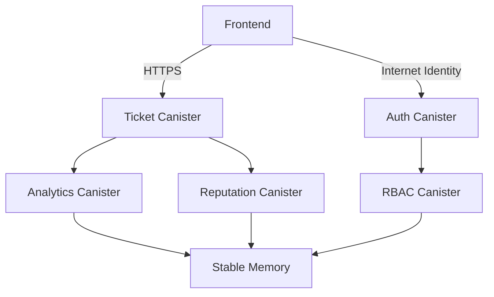

# Architecture

---

#### **1. Introduction**
This document defines the system architecture for TOC, aligned with ISO 25010 quality characteristics:
- **Performance Efficiency**
- **Compatibility**
- **Maintainability**
- **Reliability**
- **Security**
- **Functional Suitability**

---

#### **2. Architectural Goals**
| ISO 25010 Characteristic | Architectural Focus |
|--------------------------|----------------------|
| **Functional Suitability** | Full coverage of CRM workflows (ticket lifecycle, analytics). |
| **Performance Efficiency** | Sub-second response times via ICP canister parallelism. |
| **Security** | End-to-end encryption for private tickets; ICP authentication. |
| **Maintainability** | Modular canister design with versioned upgrades. |

---

#### **3. System Architecture**

##### **3.1 Component Diagram**

##### **3.2 Layer Breakdown**
1. **Presentation Layer**: React SPA with ICP agent integration.
2. **Application Layer**:
   - **Ticket Management**: Manages state transitions (Open → Closed).
   - **Analytics Engine**: Lightweight heuristics for predictions.
3. **Data Layer**: On-chain storage using ICP’s stable memory.

##### **3.3 Key Design Decisions**
- **Canister Sharding**: Horizontal scaling for ticket storage.
- **Stateless Frontend**: Session management via Internet Identity.
- **On-Chain ML Limitations**: Rule-based analytics to avoid heavy computation.

---

#### **4. Quality Attribute Scenarios**

| **Quality Attribute** | **Scenario** | **Design Response** |
|------------------------|---------------|----------------------|
| **Reliability** | Canister failure during ticket update. | Atomic transactions with rollback states. |
| **Maintainability** | Upgrade reputation algorithm. | Decoupled canisters with versioned APIs. |
| **Security** | Unauthorized ticket access. | Role-based access control (RBAC). |

---

#### **5. Technology Stack**
- **Canisters**: Motoko (primary), Rust (performance-critical modules).
- **Data Storage**: Stable B-tree structures for ticket history.
- **Encryption**: AES-256 for private tickets via `ic-crypto` library.
