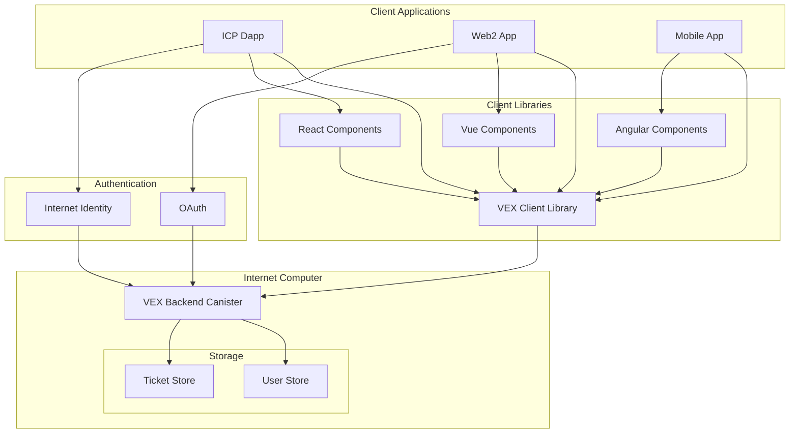
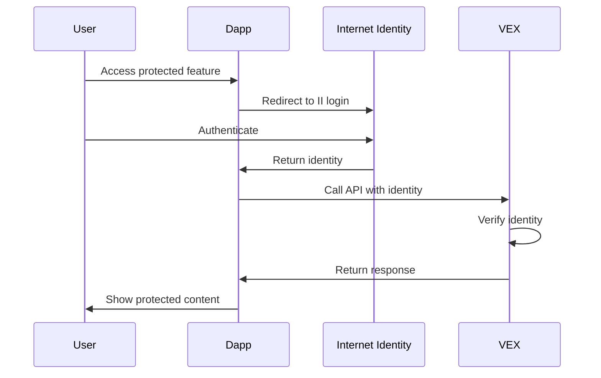
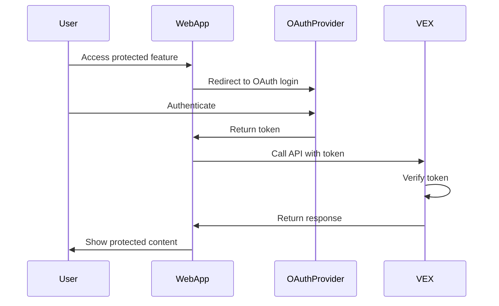

# VEX Architecture

This document describes the architecture of the VEX system, explaining its components, data flow, and design decisions.

## System Overview

VEX is built on the Internet Computer Protocol (ICP) and consists of the following main components:

1. **Backend Canister**: A Rust-based canister that provides the core functionality and data storage
2. **Client Libraries**: JavaScript/TypeScript libraries that facilitate interaction with the backend
3. **UI Components**: Optional pre-built UI components for popular frontend frameworks

## Architecture Diagram

## Component Details

### Backend Canister

The backend canister is implemented in Rust and deployed on the Internet Computer. It provides:

- User management
- Ticket creation and management
- Data storage using stable structures
- Authentication and authorization
- API endpoints for client interaction

#### Data Storage

VEX uses `ic-stable-structures` for persistent storage, which ensures data is maintained across canister upgrades. The main data structures are:

- `StableBTreeMap<u64, User>`: Stores user information
- `StableBTreeMap<u64, Ticket>`: Stores ticket information

### Client Libraries

The client libraries provide a high-level API for interacting with the VEX backend canister. They handle:

- Communication with the canister
- Authentication flow
- Data serialization/deserialization
- Error handling

### UI Components

Pre-built UI components are provided for popular frontend frameworks:

- React components
- Vue components
- Angular components

These components offer a ready-to-use interface for ticket management, reducing implementation time for developers.

## Authentication Flow

VEX supports multiple authentication methods:

### Internet Identity Authentication (for ICP dapps)

### OAuth Authentication (for Web2 apps)

## API Design

The VEX API follows these design principles:

1. **Consistency**: Similar operations follow similar patterns
2. **Simplicity**: The API is designed to be easy to use and understand
3. **Robustness**: Error handling is comprehensive and informative
4. **Efficiency**: Operations are optimized for performance

## Security Considerations

VEX implements several security measures:

- **Authentication**: All API calls require authentication
- **Authorization**: Access control ensures users can only access appropriate resources
- **Input Validation**: All user inputs are validated before processing
- **Error Handling**: Errors are handled securely without leaking sensitive information

## Scalability

VEX is designed to scale with usage:

- **Efficient Data Structures**: Optimized for performance and memory usage
- **Pagination**: Large data sets are paginated to avoid memory issues
- **Caching**: Frequently accessed data can be cached for improved performance
- **Future Multi-Canister Design**: The architecture can be extended to a multi-canister design for horizontal scaling

## Future Architectural Enhancements

Planned architectural improvements include:

1. **Multi-Canister Architecture**: Split functionality across multiple canisters for improved scalability
2. **Enhanced Authentication**: Support for additional authentication providers
3. **Pub/Sub Mechanism**: Real-time updates using a publish-subscribe pattern
4. **Offline Support**: Caching and synchronization for offline operation
5. **Advanced Analytics**: Built-in analytics for ticket trends and performance metrics 